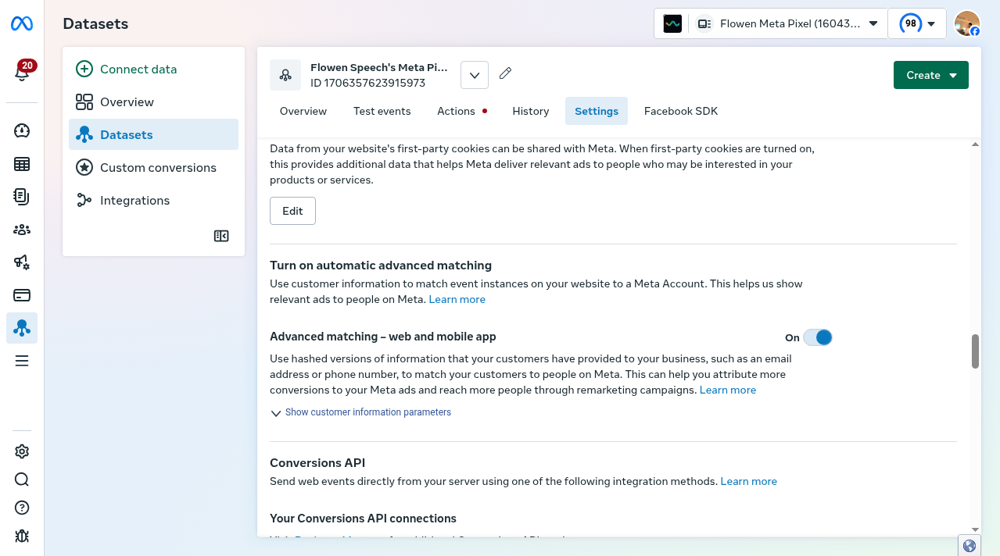
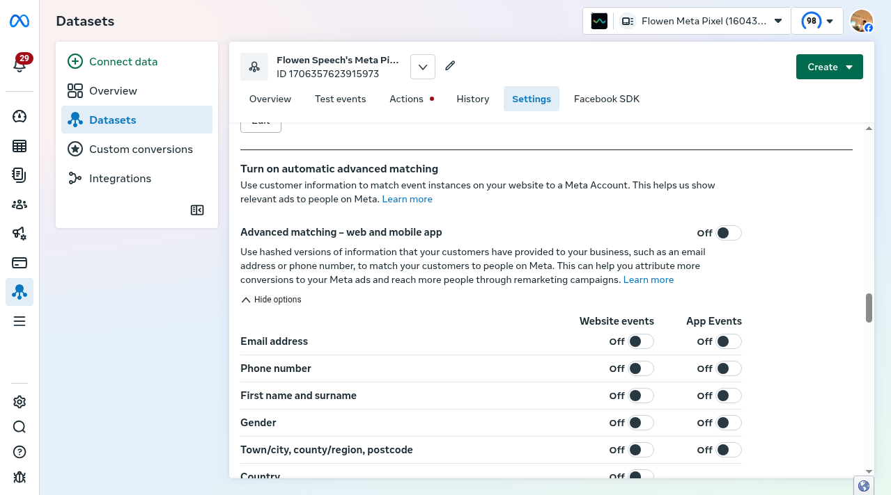
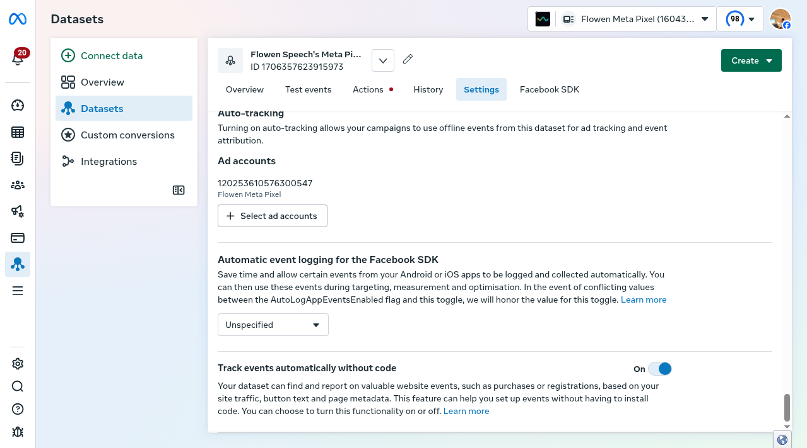
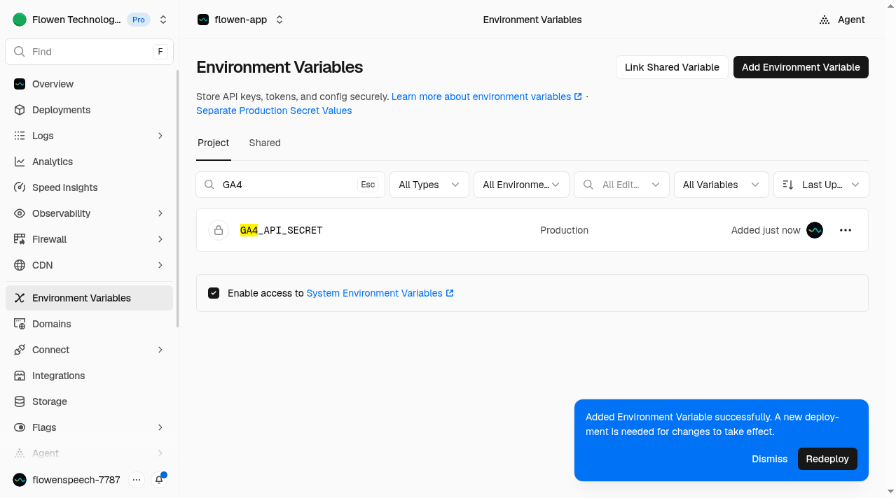

# Conversion attribution repair - September 30, 2026

Review-only implementation. Not deployed. No synthetic events sent, no campaign unpaused, no payment changes and no database mutation.

## Live settings checked and repaired

- Ads operating CID 2426627266: signup 7807797553 (`sign_up`) and trial 7807798933 (`start_trial`) are GA4 imports, Secondary, One, no revenue; paid purchase 7809043132 is click import, Primary, Every, dynamic GBP, 90-day click window. All enabled and awaiting real conversions.
- Auto-tagging enabled. Linked GA4 property 548238295, audiences and app/web metrics On.
- GA4 stream 15374461617, G-ZLES2TG8HK, has traffic in past 48 hours. Key events sign_up/start_trial/purchase exist, but no milestone data yet.
- Meta dataset 1706357623915973, Speech Technologies portfolio 1339970271256285. Explicit Pixel and CAPI integration present. No recent trial/purchase receipt was proven.
- Meta AI automatic events, detailed page/product collection, automatic matching master and no-code automatic tracking are now Off. Individual email/phone/names/gender/location/country/DOB/external-ID matching fields all read Off. Category None and core restrictions Off left unchanged for a grounded category decision. No token rotated.
- Additive dedicated GA4 MP secret created in the correct stream and stored in the vault. GA4_API_SECRET added as Vercel Production Secret. Existing values not replaced. A deployment is needed before new environment values take effect.

## Code changes

- Authenticated same-origin, rate-limited endpoint persists only real GA4 client/session IDs after independently verified server consent. GA4 provider measurement ID must match the active configuration. Service-role-only storage, no anonymous public read/write access.
- Signed positive live Stripe invoice sends GA4 purchase with actual collected amount/currency, deterministic invoice transaction ID and generic membership item. No email, clinical data or fabricated client ID. No browser purchase signal. Test-mode invoices do not send.
- Offline invoice uses real client_id, not a seven-day-old trial session or invented engagement. Google session attribution requires sending within 24 hours of session start and a timestamp within that session. Client-ID joining supports ad export but does not guarantee source/session attribution. No identity means no GA4 send. Old purchases beyond the 72-hour MP timestamp window fail closed rather than moving revenue to today.
- Per-invoice/destination atomic delivery leases replace the milestone-before-send loss bug. Completed destinations skip Stripe retries; failed destinations retry. Invoice ID remains the Meta/Ads/GA4 dedup key. Remote acceptance and local DB completion are not atomic, so exactly-once network delivery is not promised.
- Stripe awaits paid reporting; failure propagates into the existing webhook rollback/500 path for Stripe retry.
- GA4 sign_up uses the gtag Arguments queue and waits for consented tracking initialization before clearing the one-shot cookie. Readiness listener prevents the previous loss race.
- Trial Meta event moved from old billing `trialing` status to authenticated, completed zero-value subscription checkout. Consent/readiness checked before marking local dedup; Meta browser/CAPI share the verified session's deterministic event ID. GA4 remains start_trial, never purchase.
- Paid Ads action no longer silently falls back to the signup action if purchase configuration is missing.

## Validation

- TypeScript: `npx tsc --noEmit` passed (2048MB heap used locally).
- Unit tests: 37 files, 264 tests passed. New tests cover invoice totals, stable transaction ID, no fake/old session/client ID, free/negative invoices, invalid timestamps, consent queue, lookalike consent cookie, durable claims and already-sent/concurrent/storage-failure guards.
- Targeted lint clean on implementation modules except a pre-existing BillingClient setState-in-effect error in the checkout banner. Repository CI intentionally excludes repo-wide lint; do not confuse this with new conversion logic.
- Published text files read back and compared against local bytes.
- Real platform milestone receipt still unverified. MP HTTP 2xx indicates transport, not event acceptance. No fabricated real purchase or ad click used to make dashboards look green.

## Merge/deploy gate

1. Review code and the additive migration `20260930121000_conversion_delivery.sql`.
2. Resolve migration-history/schema baseline reconciliation separately. Do not run broad migration push/replay from the current unreconciled directory. This migration has NOT been applied.
3. Apply reviewed additive schema change through a coordinated, source-grounded database procedure; verify tables/function permissions.
4. Confirm Vercel check/build; Production deployment should occur only after owner merge approval and schema readiness. Production-only MP secret is deliberately absent from Preview.
5. Verify a genuine consented signup, trial, then paid invoice through platform diagnostics and per-destination delivery records. Do not call this fully working before real receipts.
6. Production signup Ads action env remains write-only/unverified. Signup's proven Ads path is GA4 import; do not blindly overwrite the server action ID. Existing Meta category/core decision is still pending.

## Screenshots

## Sources

- https://developers.google.com/analytics/devguides/collection/protocol/ga4/sending-events
- https://developers.google.com/analytics/devguides/collection/protocol/ga4/use-cases
- https://developers.google.com/analytics/devguides/collection/protocol/ga4/reference/events
- https://www.flowen.digital/admin/tracking
- https://vercel.com/flowen-technologies-speech/flowen-app/settings/environment-variables
- https://analytics.google.com/analytics/web/#/a403294378p548238295/admin/streams/table?restoreUserState=true
- https://eventsmanager.facebook.com/events_manager2/list/dataset/1706357623915973/settings?business_id=1339970271256285&global_scope_id=1339970271256285&act=1604303181408279&nav_source=scope
